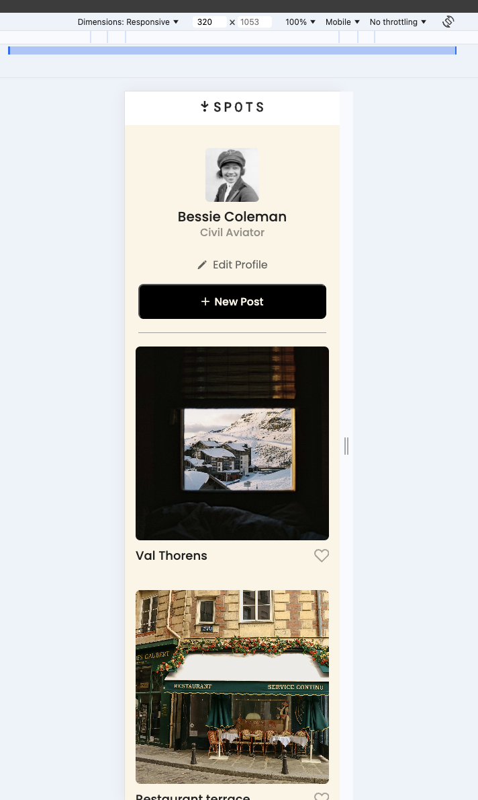
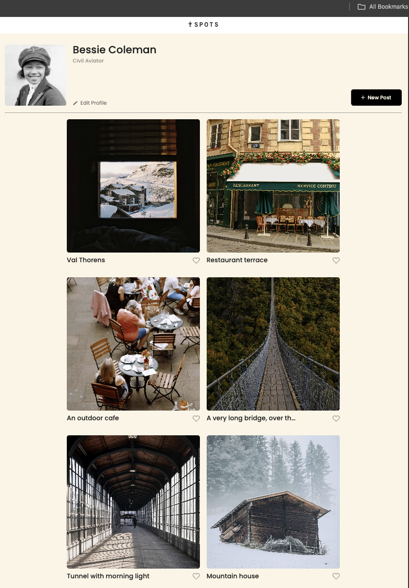
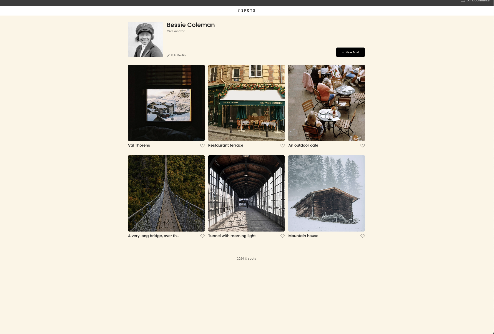

# Spots - sprint 3

## Description

Spots is what Instagram use to be back in the day. It is an Image sharing Website that allows different users to share their favorite pictures. It allows users to like other shared images on the platform as well. The more likes you get, the more users have seen and interacted with your profile. Pretty cool!

## Tech stack

- HTML
- CSS
- Responsive Design

## Pictures

Because we used grid and flexbox displays, the website is easily responsive accross different devices.

Below will have:

- Phone view
- Tablet view
- Desktop view

**Mobile view**

**Tablet view**

**Desktop view**

## Deployment

This webpage is deployed to GitHub Pages

- [Live website](https://danieln2324.github.io/se_project_spots/)
